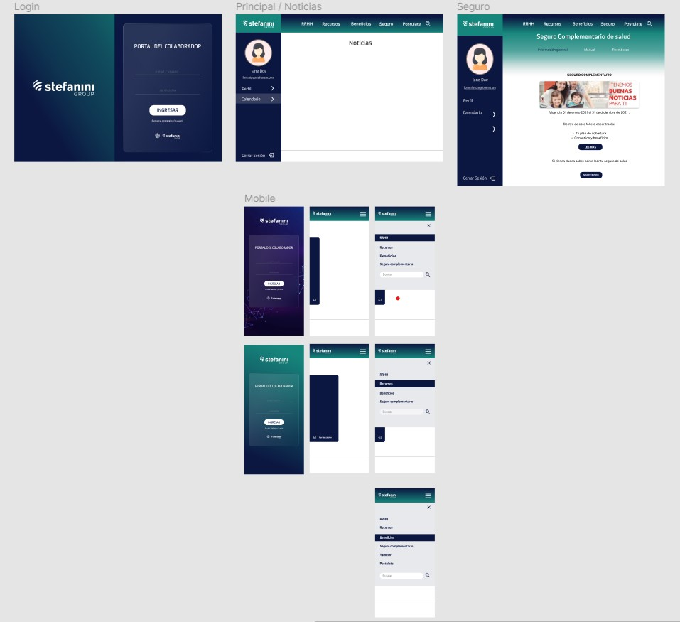

# Stefanini's Intranet

Dentro del contexto del primer Talent Fest de Laboratoria Chile, la empresa transnacional Stefanini Group, nos convocó a presentar una solución que aune los requisitos para formar parte de su camino a una transformación digital a nivel corporativo. Para ello nos presentó el reto de crear un Intranet para colaboradores o Stefaniners, donde esta última tiene que ser 360° (interna y externa) para que ellos puedan ir digitalizando y agilizando sus procesos internos.

 

## Organización y diseño

En primera instancia, basándonos en los requisitos entregados por Stefanini Group, se comenzó con una lluvia de ideas sobre la distribución de elementos y su visualización en pantalla. 

Se decidió por dos paneles principales, sidebar (barra lateral) y navbar (barra de navegación), encontrando todo lo relacionado al propio usuario en la primera y los links generales de la empresa en la segunda y el contenido de ambas se despliega en el cuerpo de la página. 

El diseño toma como referencia el branding de Stefanini; una paleta de colores característica, tipografía, iconografía, imágenes referenciales y pequeños detalles como forma de botones. 

[Enlace a Figma para más detalles](https://www.figma.com/file/NIgkrMIJ0J0QV2M4JhQ8Wm/Stefanini?node-id=0%3A1)

